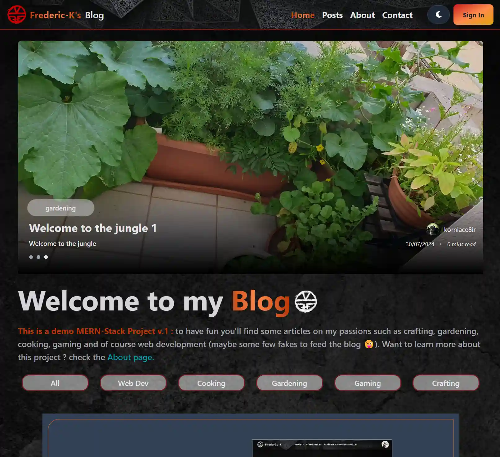

# Frederic-K Blog: Full-stack MERN Project

## Author
Frédéric KREUDER

## Category
Single Page Application (SPA) / Software as a Service (SaaS) - Full-stack MERN

## Overview
Welcome to Frederic-K's Blog v1.0! This demo blog showcases full-stack MERN development skills and features a range of functionalities for both blog owners and users.

### Key Features:
- **For Blog Owners:** Create, update, and delete posts; manage users and comments via a dashboard.
- **For Users:** 
  - Browse posts with carousels and lightboxes
  - Advanced search functionality
  - User account creation (email/password or Google sign-in)
  - Interact with posts (comment, like)
  - Contact form

### Technical Highlights:
- Built with the MERN stack (MongoDB, Express, React, Node.js)
- Frontend: React with Tailwind CSS
- Backend: Node.js and Express
- Database: MongoDB
- Enhanced features: Email validation, password recovery, contact form, database optimization

## Getting Started

To run this project locally:

1. Clone the repository
2. Install dependencies: `npm install`
3. Start the application: `npm run app`

This will launch both the frontend and backend servers concurrently.